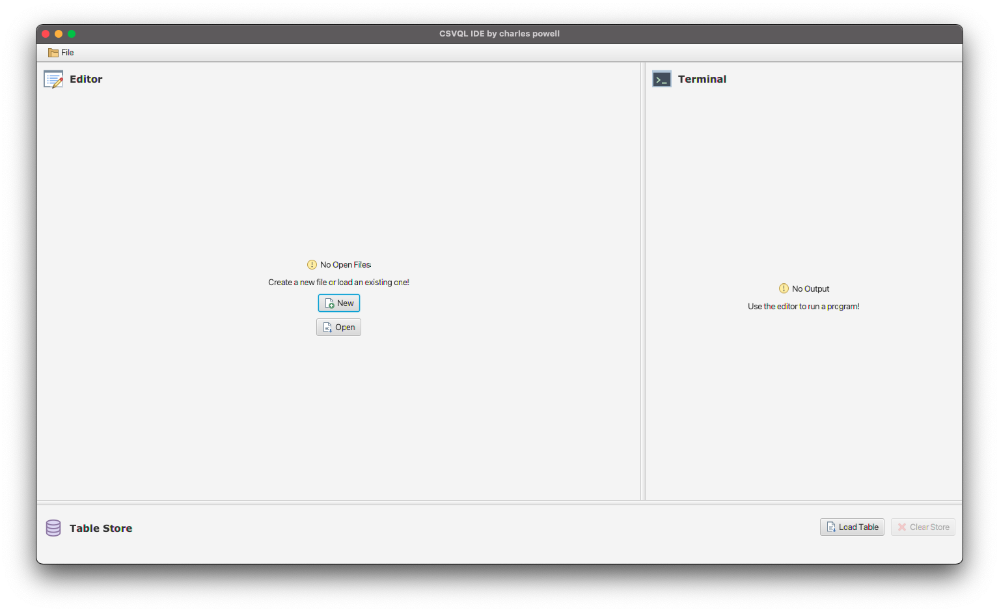
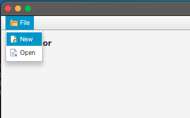
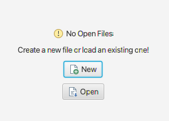
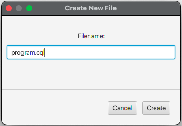
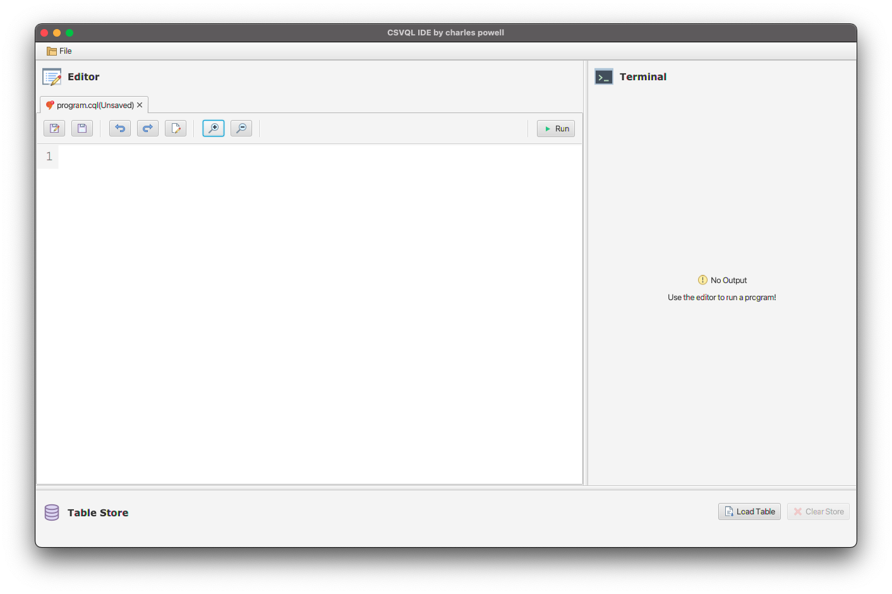
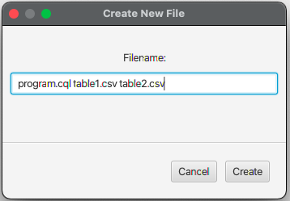
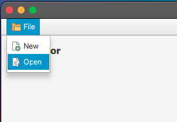
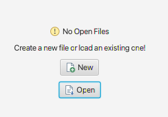
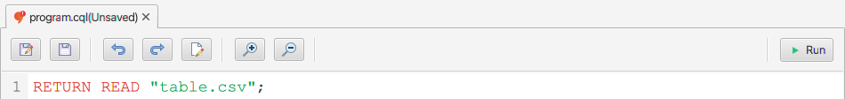
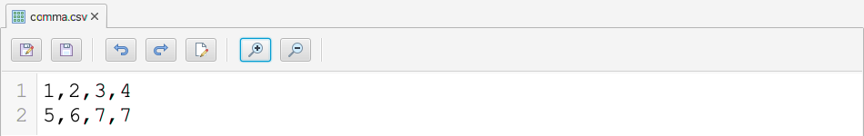

# CSV Query Language IDE

---

## Contents

- **[Introduction](#introduction)**
  * **[Background](#background)**
  * **[Project Description](#project-description)**
- **[Getting Started](#getting-started)**
- **[Application Structure](#application-structure)**
- **[Usage](#usage)**
  * **[Creating New Files](#creating-new-files)**
  * **[Opening Existing Files](#opening-existing-files)**
    + **[Open Buttons](#open-buttons)**
    + **[Drag and Drop](#drag-and-drop)**
    + **[Table Store](#table-store)**
  * **[Editor Guide](#editor-guide)**
  * **[Running Programs](#running-programs)**
    + **[Execution](#execution)**
    + **[Additional Terminal Features](#additional-terminal-features)**
- **[Additional Langauge Support](#additional-langauge-support)**
- **[Known Issues](#known-issues)**

---

## Introduction 

### Background

- For the COMP2212: Programming Language Concepts module, a programming langauge was designed that supported the querying of CSV files and an interpreter was written. 
  - This programming langauge is known as **CSV Query Language**.
  - Please refer to the [COMP2212:PLC Coursework repository](https://github.com/cekpowell/comp2212-coursework) for more information on the project, and full documentation of the CSVQL programming langauge.

### Project Description

- The goal of this project was to create an **IDE/Text Editor** for **CSV Query Language** using the JavaFX framework.
- The finished application supports the **creation**, **development** and **execution** of CSVQL programs (as well as tables in the form of CSV/text files) in a single environment and includes **highlighting** for the CSVQL syntax.
- Support has also been added for **Python** and **Java** programs in order to demonstrate the versatility of the final application, with little required to provide support for further languages.

<video src="https://user-images.githubusercontent.com/60888912/130972875-c77eecbf-c31c-42b1-a9ed-c1f78c0239a0.mp4" width="600"></video>

---

## Getting Started

*A step-by-step guide on how to run th CSVQL IDE.*

- The CSVQL IDE can be run using the provided `pom.xml` file with the `maven` framework.
- Clone the repo and use the following command to run the application:

```bash
mvn clean javafx:run
```

- On start-up, the application should look like this:

<p align="center"></p> 

---

## Application Structure

*A breakdown of the IDE's application structure.*

- The appplication is broken down into three sections.
  - **Editor**
  - **Table Store**
  - **Terminal**
- Files that are loaded into or created in the application will be displayed as a tab in the **Editor**, where they can be **edited** and **run**.
  - Each file present in the system is displayed in it's own tab in the Editor (just like normal text editors).
  - Each Editor Tab contains a toolbar that supports the saving, editing and running (if it is a program) of the file.
- All tables loaded into the system are stored in the **Table Store**, and will be available for CSVQL programs when they arerun.
  - The purpose of the Table Store is to be able to have CSV tables loaded into the system without requiring them to be open in the Editor when a program is being run.
- When running a CSVQL program, the program output is displayed in the **Terminal**.
  - The Terminal contains a toolbar that supports the saving of this output to a file, or copying it to the clipboard.

---

## Usage

*A short guide on the main features of the application.*

### Creating New Files

- The **File** menu in the **Toolbar** can be used to create a new file.

<p align="center"></p> 

-  Alterativley, when no files are open within the **Editor**, the **New** button in the center of the Editor can be used to create a new file.

<p align="center"></p> 

- When selected, a enter the **name** of the new file into the pop-up window and submit.
  - A **file extension** must be provided, and the **filetype** will be derived from this extension.
  - The file extensions supported by the system are as follows:
    - **CQL Programs**: `.cql`
    - **Tables**: `.csv`, `.txt`

<p align="center"></p> 

- After submitting the filename a new Editor Tab will be displayed for the new file.
  - If the type of file is not supported by the system, or if the provided filename is already in use, an error window is displayed and a new file is not created.

<p align="center"></p> 

- Multiple files can be created at once by supplying multiple filenames into the pop-up window, with each filename seperated by a space character.

<p align="center"> </p> 

### Opening Existing Files

#### Open Buttons

- The **File** menu in the **Toolbar** can be used to create a open an existing file.

<p align="center"></p> 

-  Alterativley, when no files are open within the **Editor**, the **Open** button in the center of the Editor can be used to create a new file.

<p align="center"></p> 

- When selected, a File Chooser window is displayed that allows for an existing CSVQL programs or tables (CSV or Text) to be chosen.
  - Only supported files can be selected within the file chooser.
- All files chosen will be displayed in the system in new Editor Tabs.
- A file will fail to load if the filename is already in use within the system.
- Any Table that is loaded into the system will also be loaded into the Table Store.

#### Drag and Drop

- Files can be dragged and dropped into the application Editor, where they will be loaded into the system.

<video src="img/drag_and_drop_editor.mov" width="700"></video>

#### Table Store

- Files can be loaded directly into the Table Store using the **Load button** in the store, or by dragging and dropping.
  - Only files of the supported type for tables can be loaded into the table store (`.csv`, .`txt`).
- A file that is loaded into the table store will not be displayed in the editor, but can be opened using the **Open In Editor** button on the graphic for the stored table.
- Files can also be removed from the table store using the **Close Button** on the graphic for the stored table.
- **All loaded tables** can be **removed** from the Table Store using the **Clear Store** button.

<video src="img/drag_and_drop_table_store.mov" width="700"></video>

### Editor Guide

- Each file open in the system is displayed in it's own tab, which contains a **Toolbar** for **controlling the file**, and a **Code Area** for editing the **code/text** within the file.
- The toolbar and code editor are configured based on the type of file that is being displayed - e.g., no 'run' button is displayed for table files, and syntax highlighting is provided for CSVQL programs.

<p align="center"></p> 

<p align="center"></p> 

#### Saving

- The **Save As** and **Save** buttons within the **Toolbar** can be used to save a file. Saving can also be used with the `CTRL S` key combination.
- If the file being saved is yet to be saved, a file chooser is displayed allowing for the save destination to be selected.

- Note that the **name**  and **graphic** of the Editor Tab are updating to reflect the **save state** of the file as changes are made within the Code Area.

<video src="img/saving.mov" width="700"></video>

#### Editing File

- The rename button can be used to **rename** a file open within the Editor.
- After selection, a pop-up window is displayed that allows for the new file name to be provided.
- If the renaming process results in the type of file changing (e.g., from CSVQL program to table), the open Editor Tab and TableStore will update to reflect this change.
- Note that a rename will fail if the provided file type is not supported by the system, or if the filename is already in use in the system.

<video src="img/rename.mov" width="700"></video>

- The **undo** and **redo** buttons can be used to **undo** and **redo** recent changes made to the Code Area respectivley.

#### View

- The view of the Code Area within an Editor Tab can be altered using the **zoom in** and **zoom out** buttons, or by using the `CTRL =` and `CTRL -` key combinations respectivley.
- Changing the zoom level within an Editor Tab will only have an effect on that said Editor Tab.

#### Removing

- Files can be **removed** from the Editor by **closing the tab** they are contained within (note this does not remove the actual file).
- If there are unsaved changes to the file, a confirmation window is displayed asking for this action to be confirmed.

### Running Programs

#### Execution

- CSVQL programs can be executed by selecting the **run** button within the Editor Tab Toolbar.
- The output of the program being run will be displayed in the **Terminal**, along with any errors that were raised.
- A **Terminal Toolbar** is displayed when output is present in the Terminal, which allows for the output to be **saved to a file** or **copied to the clipboard**, and for the **font size** to be **increased or decreased** (zoom in or out).

<video src="https://user-images.githubusercontent.com/60888912/130972875-c77eecbf-c31c-42b1-a9ed-c1f78c0239a0.mp4" width="600"></video>

---

## Additional Langauge Support

*A description of the additional programming langauges supported by the CSVQL IDE*.

- CSVQL IDE was developed to support the creation, development and execution of CSVQL files, but in order to show the versatility of it's implementation, support has also been added for **Python** and **Java** programs. 
- Simply open or create a Python/Java program within the Editor and run it for the program output to be displayed within the Terminal.


- Other langauges could easily be added into the system by providing information on the **file/langauge structure** (expected file extension, syntax rules etc) as well as defining how a program in the language should be **executed** within the application's **Controller**.

---

### Third Party Acknowledgements

*A description of the third-party packages/programs that were used in this project.*

- [**CodeMirror**](https://github.com/codemirror/CodeMirror): A CodeMirror application is embedded in a JavafX `WebView` control within each Editor Tab to provide an area for editing the file's content.

---

## Known Issues

*Documented issues with the system that could not be resolved.*

- 

---